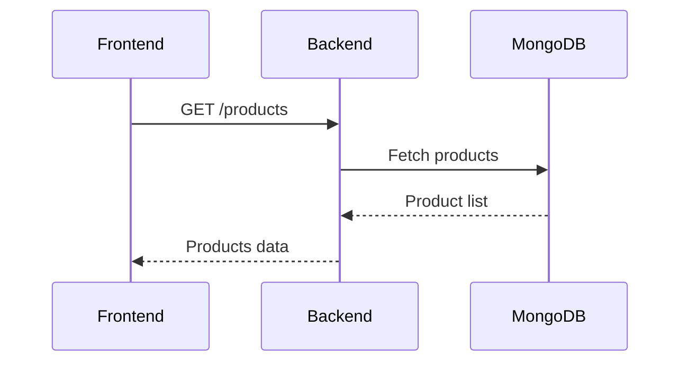
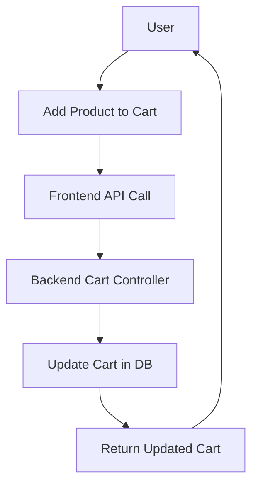

# 🛒 Full Stack E-Commerce Application

A modern **full-stack e-commerce web application** built using **Next.js (App Router)** for the frontend and **Node.js + Express + MongoDB** for the backend.  
The project demonstrates real-world concepts such as authentication, product management, cart handling, and Dockerized deployment.

---

## ✨ Features

### 🔐 Authentication
- User signup & login using JWT
- Persistent authentication using localStorage
- Protected routes (client-side)

### 🛍️ Products
- Fetch all products
- View product details
- Admin-ready structure for product management

### 🛒 Cart
- Add items to cart
- Update item quantity
- Remove items
- Clear cart

### 🧑‍💼 Admin (Structure Ready)
- Admin routes (`/admin/products`)
- Extendable for role-based access control

### 🐳 Dockerized Setup
- Backend container
- Frontend container
- Easy local setup using Docker Compose

---

## 🏗️ Tech Stack

### Frontend
- **Next.js 13+ (App Router)**
- TypeScript
- Axios
- Context API
- CSS Modules

### Backend
- **Node.js**
- Express.js
- MongoDB (Mongoose)
- JWT Authentication
- bcrypt for password hashing

### DevOps
- Docker
- Docker Compose

---

## 📂 Project Structure

```txt
project-root/
├── backend/
│   ├── src/
│   │   ├── controllers/
│   │   ├── models/
│   │   ├── routes/
│   │   ├── middleware/
│   │   └── app.js
│   ├── Dockerfile
│   └── package.json
│
├── ecommerce-frontend/
│   ├── app/
│   │   ├── auth/
│   │   ├── products/
│   │   ├── cart/
│   │   ├── admin/
│   │   ├── layout.tsx
│   │   └── page.tsx
│   ├── components/
│   ├── context/
│   ├── lib/
│   ├── types/
│   ├── Dockerfile
│   └── package.json
│
├── docker-compose.yml
└── README.md
```
## 🔄 Application Flow (Mermaid)
## 🔐 Authentication Flow

## Product fetch flow

---
## 🛒 Cart Flow

## 🐳 Docker Setup
Prerequisites

- Docker

- Docker Compose

Run the project
```
docker-compose up --build
```
## Services
| Service  | URL                                            |
| -------- | ---------------------------------------------- |
| Frontend | [http://localhost:3000](http://localhost:3000) |
| Backend  | [http://localhost:5000](http://localhost:5000) |
